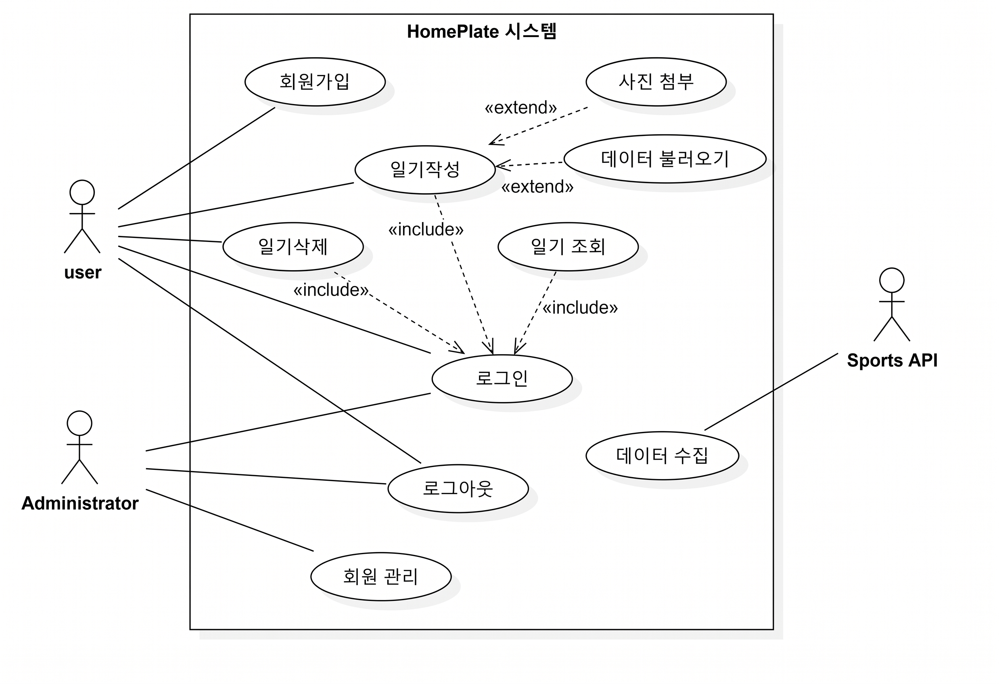
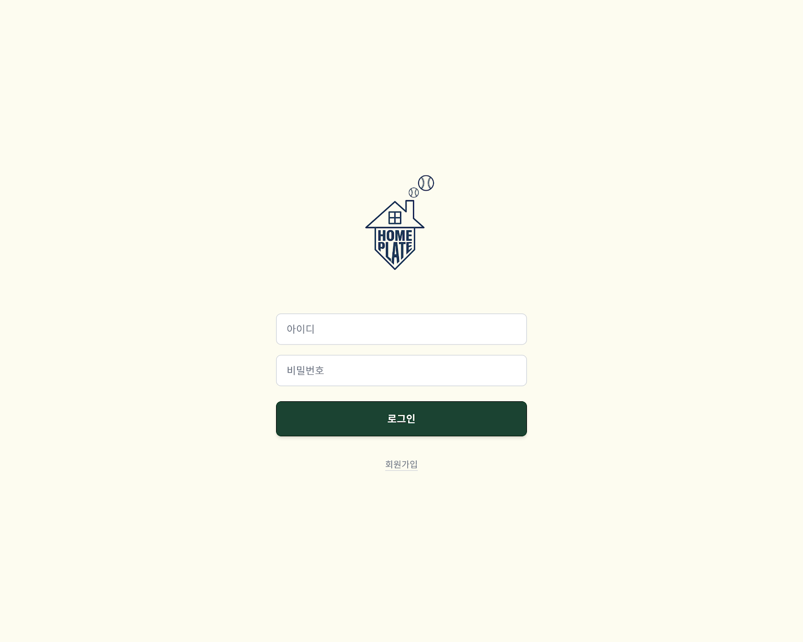
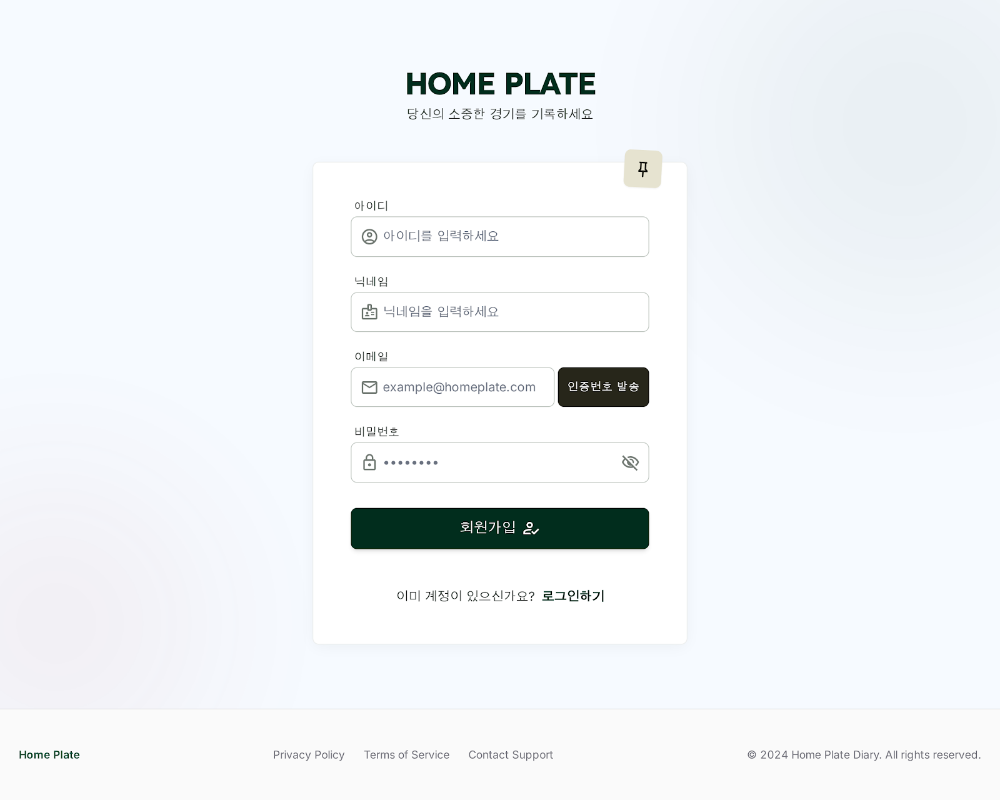
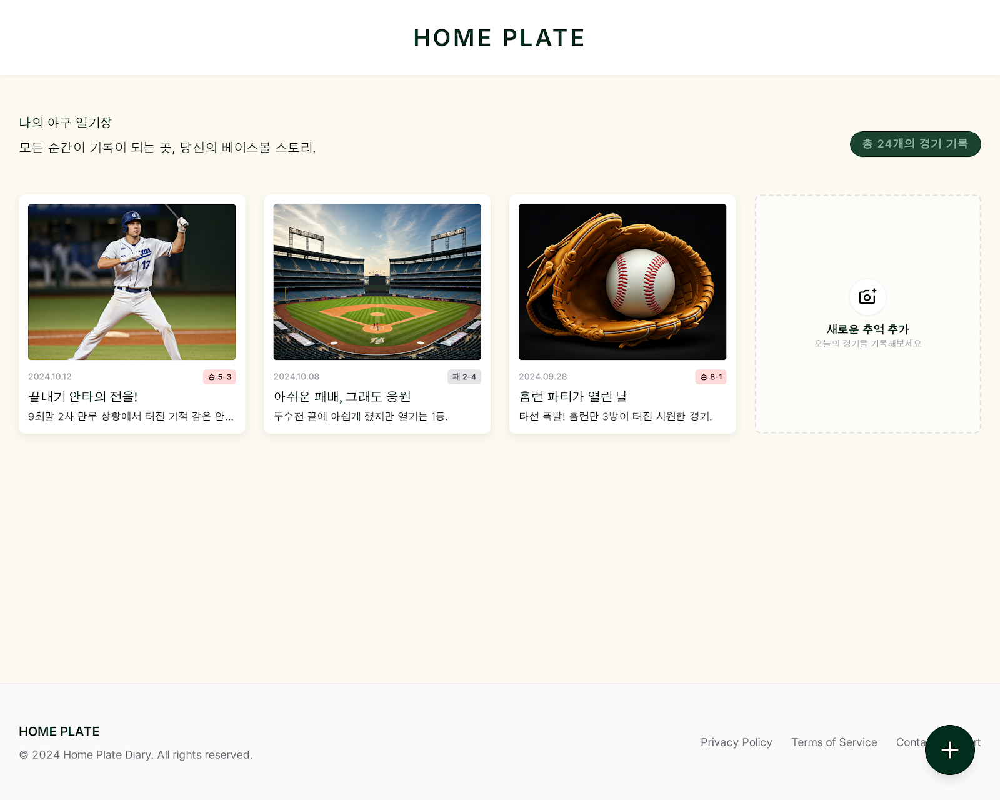
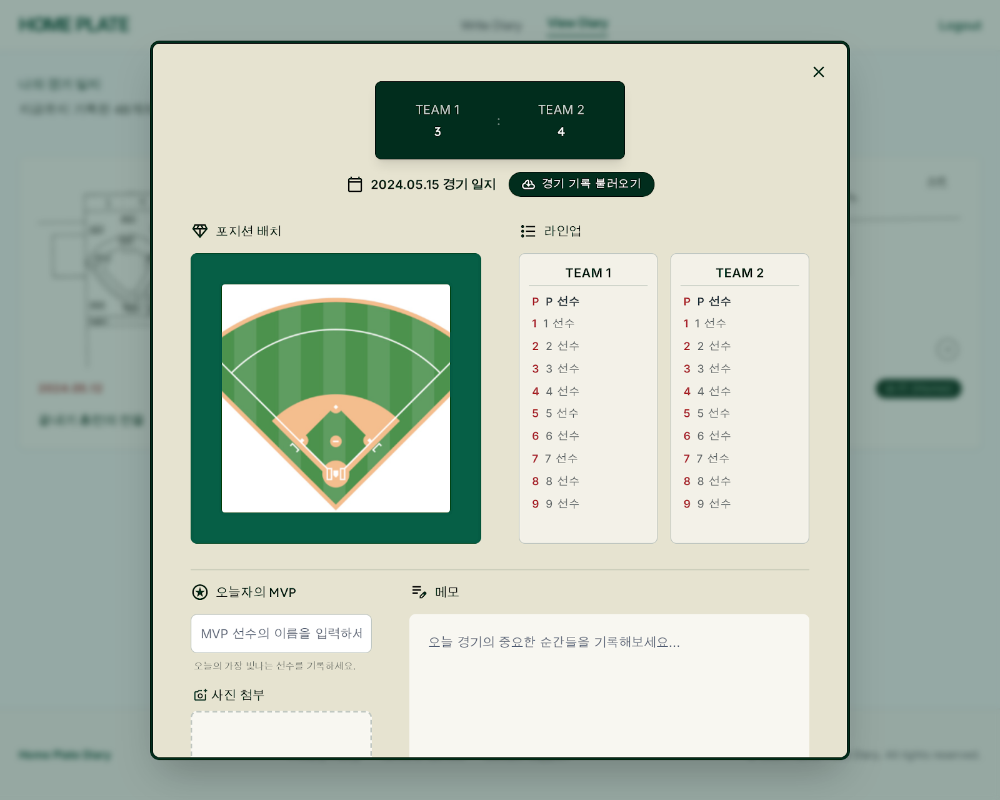

# Home Plate

###### NO. 22421628
###### NAME. 장세민
###### email. 22421628@yu.ac.kr  

- - -

## [ Revision history ]
| Reversion date | Version # | Description | Autor
|-----|-----|-----|-----|
|05/03/2026|1.0.0|First Writing||  

- - -

## 1. Business purpose

**Project background)**

2025 대한민국 프로야구 리그가 1,200만 관중을 돌파하며 역대 한 시즌 최고 관중 수를 기록하게 되었다. 야구에 대한 관심이 나날이 늘어나는 요즈음, 관중들은 스포츠를 단순히 **관람**하는 것에만 그치지 않는다. 스포츠는 팬들에게 재미를 넘어 희로애락의 다채로운 감정을 선사한다. 그리고 관중들은 그 감정을 고스란히 기억하고 추억하고자 한다. 직관과 집관에 구애 받지 않고 그날그날의 경기를 본 후 감정과 경기 정보를 저정하고 꺼내볼 수 있는 일기장 웹을 구현하고자한다

- - -

## 2. System context diagram

1) Use Case Diagram

  

2) Use case description

<table border="1">
  <tr style="background-color:gray">
    <th colspan="2">Use Case #1: 회원가입</th>
  </tr>
  <tr style="background-color:gray">
    <th colspan="2">GENERAL CHARACTERISTICS</th>
  </tr>
  <tr>
    <td style="background-color:gray"><strong>Summary</strong></td>
    <td>사용자가 HomePlate를 처음 이용하고자 할 때, 사용자의 개인 계정을 생성한다.</td>
  </tr>
  <tr>
    <td style="background-color:gray"><strong>Scope</strong></td>
    <td>HomePlate</td>
  </tr>
  <tr>
    <td style="background-color:gray"><strong>Level</strong></td>
    <td>User Level</td>
  </tr>
  <tr>
    <td style="background-color:gray"><strong>Author</strong></td>
    <td></td>
  </tr>
  <tr>
    <td style="background-color:gray"><strong>Last Update</strong></td>
    <td>2026.05.05</td>
  </tr>
  <tr>
    <td style="background-color:gray"><strong>Status</strong></td>
    <td>Analysis</td>
  </tr>
  <tr>
    <td style="background-color:gray"><strong>Primary Actor</strong></td>
    <td>User</td>
  </tr>
  <tr>
    <td style="background-color:gray"><strong>Preconditions</strong></td>
    <td>시스템이 실행되어야하며, 중복되지 않은 아이디를 가져야한다.</td>
  </tr>
  <tr>
    <td style="background-color:gray"><strong>Trigger</strong></td>
    <td>사용자가 메인화면에서 회원가입 버튼을 누른다.</td>
  </tr>
  <tr>
    <td style="background-color:gray"><strong>Success Post Condition</strong></td>
    <td>사용자 계정이 생성되며 로그인 가능 상태가 된다.</td>
  </tr>
  <tr>
    <td style="background-color:gray"><strong>Failed Post Condition</strong></td>
    <td>사용자 계정이 생성되지 않는다.</td>
  </tr>

  <tr style="background-color:gray">
    <th colspan ="2">MAIN SUCCESS SCENARIO</th>
  </tr>
  <tr>
    <td><strong>Step</strong></td>
    <td>Action</td>
  </tr>
  <tr>
    <td>S</td>
    <td>사용자가 시스템에 회원가입한다</td>
  </tr>
  <tr>
    <td>1</td>
    <td>사용자가 시스템을 실행하고 회원가입 버튼을 누른다.</td>
  </tr>
  <tr>
    <td>2</td>
    <td>시스템은 사용자에게 회원가입 양식을 보여준다</td>
  </tr>
  <tr>
    <td>3</td>
    <td>사용자는 회원가입 양식에 정보를 기입한다.</td>
  </tr>
  <tr>
    <td>4</td>
    <td>시스템은 입력한 정보를 DB에 사용자 정보를 저장한다.</td>
  </tr>
  <tr>
    <td>5</td>
    <td>사용자 계정이 생성되며 회원가입에 성공하면 끝난다.</td>
  </tr>

  <tr style="background-color:gray">
    <th colspan ="2">EXTENSION SCENARIOS</th>
  </tr>
  <tr>
    <td>Step</td>
    <td>Branching Action</td>
  </tr>
  <tr>
    <td>3</td>
    <td>3a. 양식에 맞지 않는 정보를 기입한 경우

...3a.1. 양식에 알맞는 정보를 기입하라는 메세지가 뜬다.

...3a.2. 정보를 입력하는 창으로 돌아간다.

3b. 이미 있는 사용자 계정의 정보로 가입을 하려는 경우

...3b.1. 이미 등록된 계정 정보라는 메세지가 뜬다.

...3b.2. 정보를 입력하는 창으로 돌아간다.         
    </td>
  </tr>

  <tr style="background-color:gray">
    <th colspan ="2">RELATED INFORMATION</th>
  </tr>
  <tr>
    <td>Performance</td>
    <td> &le; 2 seconds</td>
  </tr>
  <tr>
    <td>Frequency</td>
    <td>Variable</td>
  </tr>
  <tr>
    <td>Concurrency</td>
    <td>None</td>
  </tr>
  <tr>
    <td>Due Date</td>
    <td></td>
  </tr>
</table>

- - -

<table border="1">
  <tr style="background-color:gray">
    <th colspan="2">Use Case #2: 로그인</th>
  </tr>
  <tr style="background-color:gray">
    <th colspan="2">GENERAL CHARACTERISTICS</th>
  </tr>
  <tr>
    <td style="background-color:gray"><strong>Summary</strong></td>
    <td>사용자(user)와 관리자(Administrator)가 시스템 사용 권한을 얻기 위해 개인 계정에 접속한다.</td>
  </tr>
  <tr>
    <td style="background-color:gray"><strong>Scope</strong></td>
    <td>HomePlate</td>
  </tr>
  <tr>
    <td style="background-color:gray"><strong>Level</strong></td>
    <td>User Level</td>
  </tr>
  <tr>
    <td style="background-color:gray"><strong>Author</strong></td>
    <td></td>
  </tr>
  <tr>
    <td style="background-color:gray"><strong>Last Update</strong></td>
    <td>2026.05.05</td>
  </tr>
  <tr>
    <td style="background-color:gray"><strong>Status</strong></td>
    <td>Analysis</td>
  </tr>
  <tr>
    <td style="background-color:gray"><strong>Primary Actor</strong></td>
    <td>User, Administrator</td>
  </tr>
  <tr>
    <td style="background-color:gray"><strong>Preconditions</strong></td>
    <td>시스템에 회원가입이 완료된 상태여야 한다.</td>
  </tr>
  <tr>
    <td style="background-color:gray"><strong>Trigger</strong></td>
    <td>로그인 버튼을 누르거나, 일기 작성 / 일기 조회 등 로그인이 필요한 기능에 접근할 때</td>
  </tr>
  <tr>
    <td style="background-color:gray"><strong>Success Post Condition</strong></td>
    <td>로그인에 성공하여 메인화면이나 요청한 페이지로 이동한다.</td>
  </tr>
  <tr>
    <td style="background-color:gray"><strong>Failed Post Condition</strong></td>
    <td>로그인에 실패하여 기능 접근 권한을 얻지 못한다.</td>
  </tr>

  <tr style="background-color:gray">
    <th colspan ="2">MAIN SUCCESS SCENARIO</th>
  </tr>
  <tr>
    <td><strong>Step</strong></td>
    <td>Action</td>
  </tr>
  <tr>
    <td>S</td>
    <td>회원(사용자, 관리자)이 시스템에 로그인 한다.</td>
  </tr>
  <tr>
    <td>1</td>
    <td>회원이 로그인 버튼을 누른다.</td>
  </tr>
  <tr>
    <td>2</td>
    <td>시스템이 로그인 화면을 보여준다</td>
  </tr>
  <tr>
    <td>3</td>
    <td>회원이 아이디와 비밀번호를 입력한다.</td>
  </tr>
  <tr>
    <td>4</td>
    <td>시스템은 입력받은 아이디와 비밀번호가 DB에 존재하면 승인한다.</td>
  </tr>
  <tr>
    <td>5</td>
    <td>로그인에 성공하면 끝난다.</td>
  </tr>

  <tr style="background-color:gray">
    <th colspan ="2">EXTENSION SCENARIOS</th>
  </tr>
  <tr>
    <td>Step</td>
    <td>Branching Action</td>
  </tr>
  <tr>
    <td>3</td>
    <td>3a. 아이디가 DB에 존재하지 않거나, 비밀번호가 일치하지 않는 경우

...3a.1. 아이디나 비밀번호가 일치하지 않는다는 메세지를 띄운다.

...3a.2. 입력 화면으로 돌아간다
</td>
  </tr>

  <tr style="background-color:gray">
    <th colspan ="2">RELATED INFORMATION</th>
  </tr>
  <tr>
    <td>Performance</td>
    <td>&le; 2 seconds</td>
  </tr>
  <tr>
    <td>Frequency</td>
    <td>회원 당 평균 하루 1~2번</td>
  </tr>
  <tr>
    <td>Concurrency</td>
    <td>None</td>
  </tr>
  <tr>
    <td>Due Date</td>
    <td></td>
  </tr>
</table>

- - -

<table border="1">
  <tr style="background-color:gray">
    <th colspan="2">Use Case #3: 일기 작성</th>
  </tr>
  <tr style="background-color:gray">
    <th colspan="2">GENERAL CHARACTERISTICS</th>
  </tr>
  <tr>
    <td style="background-color:gray"><strong>Summary</strong></td>
    <td>사용자가 야구 직관 기록이나 시청 기록을 담은 일기를 작성하고 저장한다.</td>
  </tr>
  <tr>
    <td style="background-color:gray"><strong>Scope</strong></td>
    <td>HomePlate</td>
  </tr>
  <tr>
    <td style="background-color:gray"><strong>Level</strong></td>
    <td>User Level</td>
  </tr>
  <tr>
    <td style="background-color:gray"><strong>Author</strong></td>
    <td></td>
  </tr>
  <tr>
    <td style="background-color:gray"><strong>Last Update</strong></td>
    <td>2026.05.05</td>
  </tr>
  <tr>
    <td style="background-color:gray"><strong>Status</strong></td>
    <td>Analysis</td>
  </tr>
  <tr>
    <td style="background-color:gray"><strong>Primary Actor</strong></td>
    <td>User</td>
  </tr>
  <tr>
    <td style="background-color:gray"><strong>Preconditions</strong></td>
    <td>시스템에 로그인이 된 상태여야 한다.</td>
  </tr>
  <tr>
    <td style="background-color:gray"><strong>Trigger</strong></td>
    <td>사용자가 '일기 쓰기' 버튼을 클릭할 때</td>
  </tr>
  <tr>
    <td style="background-color:gray"><strong>Success Post Condition</strong></td>
    <td>일기 내용이 DB에 저장되고 사용자는 작성된 일기의 상세 페이지로 이동한다.</td>
  </tr>
  <tr>
    <td style="background-color:gray"><strong>Failed Post Condition</strong></td>
    <td>일기가 저장되지 못하고 사용자는 일기 작성 페이지에 계속 머문다.</td>
  </tr>

  <tr style="background-color:gray">
    <th colspan ="2">MAIN SUCCESS SCENARIO</th>
  </tr>
  <tr>
    <td><strong>Step</strong></td>
    <td>Action</td>
  </tr>
  <tr>
    <td>S</td>
    <td>사용자가 일기를 작성한다.</td>
  </tr>
  <tr>
    <td>1</td>
    <td>사용자가 일기 작성 버튼을 누른다.</td>
  </tr>
  <tr>
    <td>2</td>
    <td>시스템이 일기 작성 화면을 보여준다</td>
  </tr>
  <tr>
    <td>3</td>
    <td>사용자는 날짜와 제목, 감상 등을 입력한다.</td>
  </tr>
  <tr>
    <td>4</td>
    <td>사용자는 필요에 따라 사진을 첨부(Use case #6)하거나 라인업 등 경기 데이터를 불러온다(Use case #7).</td>
  </tr>
  <tr>
    <td>5</td>
    <td>사용자는 일기 작성을 마치면 '저장'버튼을 누른다.</td>
  </tr>
  <tr>
    <td>6</td>
    <td>시스템을 일기장을 DB에 저장한다.</td>
  </tr>
  <tr>
    <td>7</td>
    <td>저장이 완료되면 끝난다.</td>
  </tr>

  <tr style="background-color:gray">
    <th colspan ="2">EXTENSION SCENARIOS</th>
  </tr>
  <tr>
    <td>Step</td>
    <td>Branching Action</td>
  </tr>
  <tr>
    <td></td>
    <td></td>
  </tr>

  <tr style="background-color:gray">
    <th colspan ="2">RELATED INFORMATION</th>
  </tr>
  <tr>
    <td>Performance</td>
    <td>&le; 3 seconds</td>
  </tr>
  <tr>
    <td>Frequency</td>
    <td>회원 당 주 평균 3~4번 (주에 경기수 6회)</td>
  </tr>
  <tr>
    <td>Concurrency</td>
    <td>None</td>
  </tr>
  <tr>
    <td>Due Date</td>
    <td></td>
  </tr>
</table>

- - -

<table border="1">
  <tr style="background-color:gray">
    <th colspan="2">Use Case #4: 일기 조회</th>
  </tr>
  <tr style="background-color:gray">
    <th colspan="2">GENERAL CHARACTERISTICS</th>
  </tr>
  <tr>
    <td style="background-color:gray"><strong>Summary</strong></td>
    <td>사용자가 자신의 일기 목록에서 특정 일기의 상세 내용을 열람하는 기능.</td>
  </tr>
  <tr>
    <td style="background-color:gray"><strong>Scope</strong></td>
    <td>HomePlate</td>
  </tr>
  <tr>
    <td style="background-color:gray"><strong>Level</strong></td>
    <td>User Level</td>
  </tr>
  <tr>
    <td style="background-color:gray"><strong>Author</strong></td>
    <td></td>
  </tr>
  <tr>
    <td style="background-color:gray"><strong>Last Update</strong></td>
    <td>2026.05.05</td>
  </tr>
  <tr>
    <td style="background-color:gray"><strong>Status</strong></td>
    <td>Analysis</td>
  </tr>
  <tr>
    <td style="background-color:gray"><strong>Primary Actor</strong></td>
    <td>User</td>
  </tr>
  <tr>
    <td style="background-color:gray"><strong>Preconditions</strong></td>
    <td>시스템에 로그인이 된 상태여야 한다.   최소 1개의 작성된 일기가 존재해야한다.
    </td>
  </tr>
  <tr>
    <td style="background-color:gray"><strong>Trigger</strong></td>
    <td>사용자가 특정 일기 항목을 클릭할 때</td>
  </tr>
  <tr>
    <td style="background-color:gray"><strong>Success Post Condition</strong></td>
    <td>선택된 일기의 제목, 내용, 첨부사진, 데이터 등이 화면에 정상적으로 출력된다.</td>
  </tr>
  <tr>
    <td style="background-color:gray"><strong>Failed Post Condition</strong></td>
    <td>일기 내용을 불러오지 못하며 오류 메시지가 출력된다.</td>
  </tr>

  <tr style="background-color:gray">
    <th colspan ="2">MAIN SUCCESS SCENARIO</th>
  </tr>
  <tr>
    <td><strong>Step</strong></td>
    <td>Action</td>
  </tr>
  <tr>
    <td>S</td>
    <td>사용자가 작성된 일기를 조회한다.</td>
  </tr>
  <tr>
    <td>1</td>
    <td>사용자가 조회하고자 하는 일기를 클릭한다.</td>
  </tr>
  <tr>
    <td>2</td>
    <td>시스템은 선택된 일기의 ID를 기반으로 DB에서 일기 데이터를 조회한다.</td>
  </tr>
  <tr>
    <td>3</td>
    <td>시스템은 찾은 데이터를 인터페이스에 맞게 불러와 사용자에게 보여준다.</td>
  </tr>
  <tr>
    <td>4</td>
    <td>일기 상세화면이 출력되면 끝난다.</td>
  </tr>

  <tr style="background-color:gray">
    <th colspan ="2">EXTENSION SCENARIOS</th>
  </tr>
  <tr>
    <td>Step</td>
    <td>Branching Action</td>
  </tr>
  <tr>
    <td>2</td>
    <td>2a. 일기 데이터를 찾지 못하거나 불러오지 못한다.

...2a.1. 오류 메세지를 띄운다.

...2a.2. 메인화면으로 돌아간다.</td>
  </tr>

  <tr style="background-color:gray">
    <th colspan ="2">RELATED INFORMATION</th>
  </tr>
  <tr>
    <td>Performance</td>
    <td>&le; 2 seconds</td>
  </tr>
  <tr>
    <td>Frequency</td>
    <td>회원 당 하루 평균 2~3번</td>
  </tr>
  <tr>
    <td>Concurrency</td>
    <td>None</td>
  </tr>
  <tr>
    <td>Due Date</td>
    <td></td>
  </tr>
</table>

- - -

<table border="1">
  <tr style="background-color:gray">
    <th colspan="2">Use Case #5: 일기 삭제</th>
  </tr>
  <tr style="background-color:gray">
    <th colspan="2">GENERAL CHARACTERISTICS</th>
  </tr>
  <tr>
    <td style="background-color:gray"><strong>Summary</strong></td>
    <td>사용자가 자신의 일기 목록에서 특정 일기를 시스템에서 완전히 삭제한다.</td>
  </tr>
  <tr>
    <td style="background-color:gray"><strong>Scope</strong></td>
    <td>HomePlate</td>
  </tr>
  <tr>
    <td style="background-color:gray"><strong>Level</strong></td>
    <td>User Level</td>
  </tr>
  <tr>
    <td style="background-color:gray"><strong>Author</strong></td>
    <td></td>
  </tr>
  <tr>
    <td style="background-color:gray"><strong>Last Update</strong></td>
    <td>2026.05.05</td>
  </tr>
  <tr>
    <td style="background-color:gray"><strong>Status</strong></td>
    <td>Analysis</td>
  </tr>
  <tr>
    <td style="background-color:gray"><strong>Primary Actor</strong></td>
    <td>User</td>
  </tr>
  <tr>
    <td style="background-color:gray"><strong>Preconditions</strong></td>
    <td>시스템에 로그인이 된 상태여야 한다.   삭제할 일기의 상세 조회 화면에 있어야 한다. 
    </td>
  </tr>
  <tr>
    <td style="background-color:gray"><strong>Trigger</strong></td>
    <td>사용자가 특정 일기 상세 페이지에서 '삭제' 버튼을 누를 때</td>
  </tr>
  <tr>
    <td style="background-color:gray"><strong>Success Post Condition</strong></td>
    <td>해당 일기의 데이터가 작성된 일기 목록에서 사라진다.</td>
  </tr>
  <tr>
    <td style="background-color:gray"><strong>Failed Post Condition</strong></td>
    <td>일기 데이터가 보존 되며, 상세 화면에 머문다.</td>
  </tr>

  <tr style="background-color:gray">
    <th colspan ="2">MAIN SUCCESS SCENARIO</th>
  </tr>
  <tr>
    <td><strong>Step</strong></td>
    <td>Action</td>
  </tr>
  <tr>
    <td>S</td>
    <td>사용자가 일기를 삭제한다.</td>
  </tr>
  <tr>
    <td>1</td>
    <td>사용자가 '삭제' 버튼을 누른다.</td>
  </tr>
  <tr>
    <td>2</td>
    <td>시스템은 최종적으로 삭제를 확인 받는 메세지를 띄운다.</td>
  </tr>
  <tr>
    <td>3</td>
    <td>사용자가 '확인' 버튼을 누른다.</td>
  </tr>
  <tr>
    <td>4</td>
    <td>시스템은 DB에서 해당 일기 데이터와 연관 파일을 삭제한다.</td>
  </tr>
  <tr>
    <td>5</td>
    <td>삭제 완료 메세지가 뜨고 사용자는 일기 목록 화면(메인화면)으로 이동하며 use case는 끝난다.</td>
  </tr>

  <tr style="background-color:gray">
    <th colspan ="2">EXTENSION SCENARIOS</th>
  </tr>
  <tr>
    <td>Step</td>
    <td>Branching Action</td>
  </tr>
  <tr>
    <td></td>
    <td></td>
  </tr>

  <tr style="background-color:gray">
    <th colspan ="2">RELATED INFORMATION</th>
  </tr>
  <tr>
    <td>Performance</td>
    <td>&le; 2 seconds</td>
  </tr>
  <tr>
    <td>Frequency</td>
    <td>회원 당 월 평균 1~2번</td>
  </tr>
  <tr>
    <td>Concurrency</td>
    <td>None</td>
  </tr>
  <tr>
    <td>Due Date</td>
    <td></td>
  </tr>
</table>

- - -

<table border="1">
  <tr style="background-color:gray">
    <th colspan="2">Use Case #6: 사진 첨부</th>
  </tr>
  <tr style="background-color:gray">
    <th colspan="2">GENERAL CHARACTERISTICS</th>
  </tr>
  <tr>
    <td style="background-color:gray"><strong>Summary</strong></td>
    <td>일기 작성 시 경기장 직관 사진, 선수 사진, 티켓 등의 이미지를 업로드한다.</td>
  </tr>
  <tr>
    <td style="background-color:gray"><strong>Scope</strong></td>
    <td>HomePlate</td>
  </tr>
  <tr>
    <td style="background-color:gray"><strong>Level</strong></td>
    <td>Subfunction Level</td>
  </tr>
  <tr>
    <td style="background-color:gray"><strong>Author</strong></td>
    <td></td>
  </tr>
  <tr>
    <td style="background-color:gray"><strong>Last Update</strong></td>
    <td>2026.05.05</td>
  </tr>
  <tr>
    <td style="background-color:gray"><strong>Status</strong></td>
    <td>Analysis</td>
  </tr>
  <tr>
    <td style="background-color:gray"><strong>Primary Actor</strong></td>
    <td>User</td>
  </tr>
  <tr>
    <td style="background-color:gray"><strong>Preconditions</strong></td>
    <td>사용자가 일기작성 프로세스 진행 중에 있어야한다.</td>
  </tr>
  <tr>
    <td style="background-color:gray"><strong>Trigger</strong></td>
    <td>사용자가 일기 작성 화면 내에서 '사진 첨부' 버튼을 클릭할 때</td>
  </tr>
  <tr>
    <td style="background-color:gray"><strong>Success Post Condition</strong></td>
    <td>사진이 서버에 업로드되고, 일기 작성 화면에 썸네일이 표시된다.</td>
  </tr>
  <tr>
    <td style="background-color:gray"><strong>Failed Post Condition</strong></td>
    <td>사진 업로드에 실패하며 오류 메시지가 출력된다.</td>
  </tr>

  <tr style="background-color:gray">
    <th colspan ="2">MAIN SUCCESS SCENARIO</th>
  </tr>
  <tr>
    <td><strong>Step</strong></td>
    <td>Action</td>
  </tr>
  <tr>
    <td>S</td>
    <td>사용자가 일기 작성 중 이미지를 첨부한다.</td>
  </tr>
  <tr>
    <td>1</td>
    <td>사용자가 '사진 첨부' 버튼을 누른다.</td>
  </tr>
  <tr>
    <td>2</td>
    <td>사용자가 로컬 환경(PC/Mobile)에서 이미지 파일을 선택한다.</td>
  </tr>
  <tr>
    <td>3</td>
    <td>시스템은 이미지 파일의 확장자(jpg, png 등)와 용량을 검사한다.</td>
  </tr>
  <tr>
    <td>4</td>
    <td>시스템은 파일을 업로드하고 작성 폼에 미리보기를 렌더링한다.</td>
  </tr>
  <tr>
    <td>5</td>
    <td>사진이 정상적으로 업로드 되면 끝난다.</td>
  </tr>

  <tr style="background-color:gray">
    <th colspan ="2">EXTENSION SCENARIOS</th>
  </tr>
  <tr>
    <td>Step</td>
    <td>Branching Action</td>
  </tr>
  <tr>
    <td>3</td>
    <td>3a. 파일 용량 초과 또는 지원하지 않는 확장자인 경우

...3a1. 업로드 실패 경고창을 띄운다.

...3a2. 파일 선택을 취소하고 원래 화면으로 돌아간다.</td>
  </tr>

  <tr style="background-color:gray">
    <th colspan ="2">RELATED INFORMATION</th>
  </tr>
  <tr>
    <td>Performance</td>
    <td>&le; 5 seconds (용량과 네트워크 상황에 따라 상이)</td>
  </tr>
  <tr>
    <td>Frequency</td>
    <td>일기 작성 시 평균 1~3회</td>
  </tr>
  <tr>
    <td>Concurrency</td>
    <td>None</td>
  </tr>
  <tr>
    <td>Due Date</td>
    <td></td>
  </tr>
</table>

- - -

<table border="1">
  <tr style="background-color:gray">
    <th colspan="2">Use Case #7: 데이터 불러오기</th>
  </tr>
  <tr style="background-color:gray">
    <th colspan="2">GENERAL CHARACTERISTICS</th>
  </tr>
  <tr>
    <td style="background-color:gray"><strong>Summary</strong></td>
    <td>일기 작성 시 선택한 날짜에 해당하는 실제 KBO 야구 경기 데이터(라인업, 스코어보드 등)를 불러와 일기 본문에 삽입한다.</td>
  </tr>
  <tr>
    <td style="background-color:gray"><strong>Scope</strong></td>
    <td>HomePlate</td>
  </tr>
  <tr>
    <td style="background-color:gray"><strong>Level</strong></td>
    <td>Subfunction Level</td>
  </tr>
  <tr>
    <td style="background-color:gray"><strong>Author</strong></td>
    <td></td>
  </tr>
  <tr>
    <td style="background-color:gray"><strong>Last Update</strong></td>
    <td>2026.05.05</td>
  </tr>
  <tr>
    <td style="background-color:gray"><strong>Status</strong></td>
    <td>Analysis</td>
  </tr>
  <tr>
    <td style="background-color:gray"><strong>Primary Actor</strong></td>
    <td>User</td>
  </tr>
  <tr>
    <td style="background-color:gray"><strong>Preconditions</strong></td>
    <td>사용자가 일기작성 프로세스 진행 중에 있어야한다.

시스템 DB에 해당 날짜의 경기 데이터가 존재해야 한다 (데이터 수집 완료 상태).
    </td>
  </tr>
  <tr>
    <td style="background-color:gray"><strong>Trigger</strong></td>
    <td>사용자가 '경기 데이터 불러오기' 버튼을 클릭할 때</td>
  </tr>
  <tr>
    <td style="background-color:gray"><strong>Success Post Condition</strong></td>
    <td>선택한 경기의 선발 라인업과 경기 결과가 일기 템플릿(야구장 필드 이미지 등)에 매핑되어 삽입된다.</td>
  </tr>
  <tr>
    <td style="background-color:gray"><strong>Failed Post Condition</strong></td>
    <td>데이터를 불러오지 못하며, 수동 입력 폼이 유지된다.</td>
  </tr>

  <tr style="background-color:gray">
    <th colspan ="2">MAIN SUCCESS SCENARIO</th>
  </tr>
  <tr>
    <td><strong>Step</strong></td>
    <td>Action</td>
  </tr>
  <tr>
    <td>S</td>
    <td>사용자가 일기 작성 중 경기 데이터를 불러온다.</td>
  </tr>
  <tr>
    <td>1</td>
    <td>사용자가 경기 데이터 불러오기 버튼을 누르고 불러올 오늘의 경기 일정을 선택한다.</td>
  </tr>
  <tr>
    <td>2</td>
    <td>시스템은 DB를 조회하여 해당 경기의 상세 데이터(라인업 등)를 가져온다.</td>
  </tr>
  <tr>
    <td>3</td>
    <td>가져온 데이터를 일기 폼 구조에 맞게 자동 배치하여 화면에 렌더링한다.</td>
  </tr>
    <tr>
    <td>4</td>
    <td>데이터들이 정상적으로 불러와지면 끝난다.</td>
  </tr>

  <tr style="background-color:gray">
    <th colspan ="2">EXTENSION SCENARIOS</th>
  </tr>
  <tr>
    <td>Step</td>
    <td>Branching Action</td>
  </tr>
  <tr>
    <td>3</td>
    <td>3a. 선택한 날짜/팀의 경기 데이터가 시스템에 없는 경우(우천 취소 등)

...3a1. "해당 날짜의 경기 데이터가 없습니다" 메시지를 띄운다.

...3a2. 사용자가 직접 텍스트로 기입할 수 있도록 유도한다.
</td>
  </tr>

  <tr style="background-color:gray">
    <th colspan ="2">RELATED INFORMATION</th>
  </tr>
  <tr>
    <td>Performance</td>
    <td>&le; 3 seconds</td>
  </tr>
  <tr>
    <td>Frequency</td>
    <td>일기 작성 시 평균 1회</td>
  </tr>
  <tr>
    <td>Concurrency</td>
    <td>None</td>
  </tr>
  <tr>
    <td>Due Date</td>
    <td></td>
  </tr>
</table>

- - -

<table border="1">
  <tr style="background-color:gray">
    <th colspan="2">Use Case #8: 데이터 수집</th>
  </tr>
  <tr style="background-color:gray">
    <th colspan="2">GENERAL CHARACTERISTICS</th>
  </tr>
  <tr>
    <td style="background-color:gray"><strong>Summary</strong></td>
    <td>일기 작성 시 선택한 날짜에 해당하는 실제 KBO 야구 경기 데이터(라인업, 스코어보드 등)를 불러와 일기 본문에 삽입한다.</td>
  </tr>
  <tr>
    <td style="background-color:gray"><strong>Scope</strong></td>
    <td>HomePlate</td>
  </tr>
  <tr>
    <td style="background-color:gray"><strong>Level</strong></td>
    <td>System Level</td>
  </tr>
  <tr>
    <td style="background-color:gray"><strong>Author</strong></td>
    <td></td>
  </tr>
  <tr>
    <td style="background-color:gray"><strong>Last Update</strong></td>
    <td>2026.05.05</td>
  </tr>
  <tr>
    <td style="background-color:gray"><strong>Status</strong></td>
    <td>Analysis</td>
  </tr>
  <tr>
    <td style="background-color:gray"><strong>Primary Actor</strong></td>
    <td>Sports API</td>
  </tr>
  <tr>
    <td style="background-color:gray"><strong>Preconditions</strong></td>
    <td>Sports API 서버가 정상 동작 중이여야 한다.
    </td>
  </tr>
  <tr>
    <td style="background-color:gray"><strong>Trigger</strong></td>
    <td>서버에 설정된 주기(Scheduler)에 도달하거나 관리자의 수동 동기화 요청이 있을 때</td>
  </tr>
  <tr>
    <td style="background-color:gray"><strong>Success Post Condition</strong></td>
    <td>최근 야구 경기 데이터가 정상적으로 시스템 DB에 저장된다.</td>
  </tr>
  <tr>
    <td style="background-color:gray"><strong>Failed Post Condition</strong></td>
    <td>기존 DB 데이터가 유지되며, 시스템 로그에 에러 내역이 기록된다.</td>
  </tr>

  <tr style="background-color:gray">
    <th colspan ="2">MAIN SUCCESS SCENARIO</th>
  </tr>
  <tr>
    <td><strong>Step</strong></td>
    <td>Action</td>
  </tr>
  <tr>
    <td>S</td>
    <td>시스템이 Sports API를 통해 야구 경기 데이터를 DB에 저장한다.</td>
  </tr>
  <tr>
    <td>1</td>
    <td>시스템이 지정된 시간에 Sports API 측으로 HTTP GET 요청을 보낸다.</td>
  </tr>
  <tr>
    <td>2</td>
    <td>Sports API는 요청받은 경기 데이터를 시스템에 반환한다.</td>
  </tr>
  <tr>
    <td>3</td>
    <td>시스템은 반환된 응답 데이터를 HomePlate의 DB 포맷에 맞게 정제한다.</td>
  </tr>
    <tr>
    <td>4</td>
    <td>데이터를 DB에 저장하고 끝난다.</td>
  </tr>

  <tr style="background-color:gray">
    <th colspan ="2">EXTENSION SCENARIOS</th>
  </tr>
  <tr>
    <td>Step</td>
    <td>Branching Action</td>
  </tr>
  <tr>
    <td>2</td>
    <td>2a. Sports API 서버 장애 또는 타임아웃 발생

...2a1. 데이터 수집을 중단하고 실패 로그를 DB/파일에 기록한다.

...2a2. n분 후 재시도(Retry) 로직을 수행한다.
</td>
  </tr>

  <tr style="background-color:gray">
    <th colspan ="2">RELATED INFORMATION</th>
  </tr>
  <tr>
    <td>Performance</td>
    <td>&le; 10 seconds (대량 데이터 재배치)</td>
  </tr>
  <tr>
    <td>Frequency</td>
    <td>시스템 기준 하루 1~2번</td>
  </tr>
  <tr>
    <td>Concurrency</td>
    <td>단일 프로세스 (중복 수집 금지)</td>
  </tr>
  <tr>
    <td>Due Date</td>
    <td></td>
  </tr>
</table>

- - -

<table border="1">
  <tr style="background-color:gray">
    <th colspan="2">Use Case #9: 로그아웃</th>
  </tr>
  <tr style="background-color:gray">
    <th colspan="2">GENERAL CHARACTERISTICS</th>
  </tr>
  <tr>
    <td style="background-color:gray"><strong>Summary</strong></td>
    <td>현재 계정에서 로그아웃한다.</td>
  </tr>
  <tr>
    <td style="background-color:gray"><strong>Scope</strong></td>
    <td>HomePlate</td>
  </tr>
  <tr>
    <td style="background-color:gray"><strong>Level</strong></td>
    <td>User Level</td>
  </tr>
  <tr>
    <td style="background-color:gray"><strong>Author</strong></td>
    <td></td>
  </tr>
  <tr>
    <td style="background-color:gray"><strong>Last Update</strong></td>
    <td>2026.05.05</td>
  </tr>
  <tr>
    <td style="background-color:gray"><strong>Status</strong></td>
    <td>Analysis</td>
  </tr>
  <tr>
    <td style="background-color:gray"><strong>Primary Actor</strong></td>
    <td>User, Administrator</td>
  </tr>
  <tr>
    <td style="background-color:gray"><strong>Preconditions</strong></td>
    <td>회원(사용자, 관리자)이 시스템에 로그인되어 있는 상태여야 한다.</td>
  </tr>
  <tr>
    <td style="background-color:gray"><strong>Trigger</strong></td>
    <td>메인화면에서 '로그아웃' 버튼을 누를 때</td>
  </tr>
  <tr>
    <td style="background-color:gray"><strong>Success Post Condition</strong></td>
    <td>정상적으로 로그아웃되어 비회원용 메인화면으로 돌아간다.</td>
  </tr>
  <tr>
    <td style="background-color:gray"><strong>Failed Post Condition</strong></td>
    <td>로그아웃에 실패하여 기존의 상태를 유지한다.</td>
  </tr>

  <tr style="background-color:gray">
    <th colspan ="2">MAIN SUCCESS SCENARIO</th>
  </tr>
  <tr>
    <td><strong>Step</strong></td>
    <td>Action</td>
  </tr>
  <tr>
    <td>S</td>
    <td>회원(사용자, 관리자)이 시스템에 로그아웃 한다.</td>
  </tr>
  <tr>
    <td>1</td>
    <td>회원이 로그아웃 버튼을 누른다.</td>
  </tr>
  <tr>
    <td>2</td>
    <td>시스템은 회원의 쿠키/토큰을 삭제하고 서버의 세션을 만료 처리한다.</td>
  </tr>
  <tr>
    <td>3</td>
    <td>정상적으로 로그아웃 처리 후 메인 화면으로 리다이렉트 된다.</td>
  </tr>

  <tr style="background-color:gray">
    <th colspan ="2">EXTENSION SCENARIOS</th>
  </tr>
  <tr>
    <td>Step</td>
    <td>Branching Action</td>
  </tr>
  <tr>
    <td></td>
    <td></td>
  </tr>

  <tr style="background-color:gray">
    <th colspan ="2">RELATED INFORMATION</th>
  </tr>
  <tr>
    <td>Performance</td>
    <td>&le; 1 seconds</td>
  </tr>
  <tr>
    <td>Frequency</td>
    <td>회원 당 평균 하루 1번</td>
  </tr>
  <tr>
    <td>Concurrency</td>
    <td>None</td>
  </tr>
  <tr>
    <td>Due Date</td>
    <td></td>
  </tr>
</table>

- - -

<table border="1">
  <tr style="background-color:gray">
    <th colspan="2">Use Case #10: 회원관리</th>
  </tr>
  <tr style="background-color:gray">
    <th colspan="2">GENERAL CHARACTERISTICS</th>
  </tr>
  <tr>
    <td style="background-color:gray"><strong>Summary</strong></td>
    <td>관리자가 시스템에 가입한 사용자들의 목록을 조회하고 계정 상태(정지, 삭제 등)를 제어한다.</td>
  </tr>
  <tr>
    <td style="background-color:gray"><strong>Scope</strong></td>
    <td>HomePlate</td>
  </tr>
  <tr>
    <td style="background-color:gray"><strong>Level</strong></td>
    <td>User Level</td>
  </tr>
  <tr>
    <td style="background-color:gray"><strong>Author</strong></td>
    <td></td>
  </tr>
  <tr>
    <td style="background-color:gray"><strong>Last Update</strong></td>
    <td>2026.05.05</td>
  </tr>
  <tr>
    <td style="background-color:gray"><strong>Status</strong></td>
    <td>Analysis</td>
  </tr>
  <tr>
    <td style="background-color:gray"><strong>Primary Actor</strong></td>
    <td>Administrator</td>
  </tr>
  <tr>
    <td style="background-color:gray"><strong>Preconditions</strong></td>
    <td>관리자 권한을 가진 계정으로 로그인되어 있어야 한다.</td>
  </tr>
  <tr>
    <td style="background-color:gray"><strong>Trigger</strong></td>
    <td>관리자가 '회원 관리' 버튼을 클릭할 때</td>
  </tr>
  <tr>
    <td style="background-color:gray"><strong>Success Post Condition</strong></td>
    <td>회원의 상태 변경(제재, 권한 부여 등)이 DB에 반영된다.</td>
  </tr>
  <tr>
    <td style="background-color:gray"><strong>Failed Post Condition</strong></td>
    <td>회원 정보가 변경되지 않는다.</td>
  </tr>

  <tr style="background-color:gray">
    <th colspan ="2">MAIN SUCCESS SCENARIO</th>
  </tr>
  <tr>
    <td><strong>Step</strong></td>
    <td>Action</td>
  </tr>
  <tr>
    <td>S</td>
    <td>관리자가 회원을 관리한다.</td>
  </tr>
  <tr>
    <td>1</td>
    <td>회원이 회원관리 버튼을 누른다.</td>
  </tr>
  <tr>
    <td>2</td>
    <td>시스템은 권환을 확인하고, DB에서 가입된 모든 회원의 목록(ID, 가입일, 작성 일기 수 등)을 불러와 출력한다.</td>
  </tr>
  <tr>
    <td>3</td>
    <td>관리자가 특정 회원을 검색하거나 선택하여 상세 정보를 확인한다.</td>
  </tr>
  <tr>
    <td>4</td>
    <td>관리자가 해당 회원의 상태(예: 악성 유저 차단)를 변경하고 '저장' 버튼을 누른다.</td>
  </tr>
  <tr>
    <td>5</td>
    <td>시스템은 DB에 해당 회원의 상태값을 업데이트하고 끝난다</td>
  </tr>

  <tr style="background-color:gray">
    <th colspan ="2">EXTENSION SCENARIOS</th>
  </tr>
  <tr>
    <td>Step</td>
    <td>Branching Action</td>
  </tr>
  <tr>
    <td>2</td>
    <td>2a. 관리자 세션이 만료되었거나 비정상적인 권한 접근인 경우 (관리자 계정이 아닌 경우)
...2a.1. "권한이 없습니다" 에러 메시지를 출력한다.

...2a.2. 메인 화면으로 이동한다.</td>
  </tr>

  <tr style="background-color:gray">
    <th colspan ="2">RELATED INFORMATION</th>
  </tr>
  <tr>
    <td>Performance</td>
    <td>&le; 2 seconds</td>
  </tr>
  <tr>
    <td>Frequency</td>
    <td>관리자 당 평균 하루 1~2번</td>
  </tr>
  <tr>
    <td>Concurrency</td>
    <td>None</td>
  </tr>
  <tr>
    <td>Due Date</td>
    <td></td>
  </tr>
</table>

- - -

## 3. Domain analysis

1) Main_homePalte

시스템의 모든 과정이 이 클래스를 통해 시행된다.

모든 클래스와 attribute와 operation은 이 클래스를 통해 실행 및 변경이 이루어진다.

로그인한 User에게 지금까지 작성한 일기 목록을 메인화면에 직접 보여주며, 일기 작성·조회·삭제 등의 기능에 접근할 수 있는 진입점 역할을 한다.

 

2)  Registration

시스템을 이용하기 위한 권한을 부여하는 클래스이다.

이 클래스를 통해 회원가입 한 사용자만 로그인 기능을 사용할 수 있다.

관리자의 경우, 개발 단계에서 관리자 계정을 등록해두므로 따로 회원가입을 하지는 않는다.

 

3) Login

시스템을 사용하기 위해 실행해야 하는 클래스이다.

시스템에 접근하려는 사용자가 누구인지 판별하고, 그 결과를 시스템에 알려준다.

 

4) Logout

로그인된 사용자가 시스템 사용을 종료할 때 사용하는 클래스이다.

현재 세션을 종료하고 초기 화면으로 돌아가게 한다.

 

5) Management

Administrator가 User 정보를 관리하는 클래스이다.

 

6) DataCollector

매일 일정한 시간에 시스템이 자동으로 실행하는 클래스이다.

Sports API에 접근하여 당일의 경기 일정과 라인업, 스코어 등의 경기 정보를 받아온 후, 시스템 내부에서 사용 가능한 형식으로 가공하여 DB에 저장한다.

이를 통해 사용자가 일기를 작성할 때 API를 직접 호출하지 않고도 즉시 경기 정보를 활용할 수 있게 한다. 

 

7) LoadGameData

사용자가 일기 작성 중 '경기 기록 불러오기' 기능을 선택했을 때 실행되는 클래스이다.

사용자가 선택한 날짜와 경기에 해당하는 레코드를 DB로부터 조회하여 가져와 WirteDiary의 일기 템플릿(라인업, 최종 스토어 등 필드)에 자동으로 채워준다.

 

8) AddPhoto

일기에 사진을 추가할 때 사용하는 클래스이다.

User가 업로드한 이미지 파일을 해당 일기에 첨부하여 Diary 클래스에 함께 저장한다.

 

9) WirteDiary

User가 새로운 야구 일기를 작성할 때 사용하는 클래스이다.
LoadGameData를 통해 불러온 경기 정보가 템플릿에 자동 입력되며, 사용자는 그 외에 경기 감상, MVP 등 주관적 요소를 추가로 입력하여 Diary에 저장한다. 

 

10) Diary

사용자가 작성한 일기 데이터를 저장하는 클래스이다.

WriteDiary, ViewDiary, DeleteDiary, AddPhoto 클래스의 작업 대상이 된다.

 

11) ViewDiary 

User가 이전에 작성한 일기를 다시 조회할 때 사용하는 클래스이다. 

메인화면에서 선택한 일기에 해당하는 데이터를 Diary 클래스로부터 불러와 사용자에게 보여준다.

 

12) DeleteDiary

User가 더 이상 필요 없는 일기를 삭제할 때 사용하는 클래스이다.

Diary 클래스에 저장된 해당 기록을 DB에서 제거한다.

- - -

## 4. User Interface prototype

1) 시작 화면

- 시스템이 시작하면 로그인 화면이 제일 먼저 뜨게 된다.
- 사용자는 아이디와 비밀번호를 넣고 개인 계정으로 접속하게 된다.

2) 회원 가입 화면

- 회원가입 버튼을 누르면 뜨는 화면
- 닉네임과 아이디, 비밀번호를 기입하고 회원가입을 진행한다

3) 메인 화면

- 로그인 성공 시 뜨는 개인 사용자 계정 화면
- 지금까지 작성한 일기 목록이 액자형으로 뜬다 
- +를 누르면 새로운 일기 작성 템플릿이 뜨며 일기 작성이 가능해진다

4) 일기 작성 및 조회 화면

- 일기 작성 버튼을 누르면 뜨는 일기 작성 템플릿 화면
- 경기 기록 불러오기를 누르면 경기 기록이 자동으로 불러와져, 라인업지와 포지션 배치 필드가 자동으로 채워진다

- - -

## 5. Glossary

- - -

## 6. References