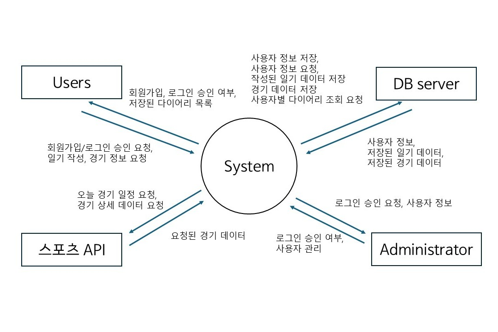

# Home Plate

###### NO. 22421628
###### NAME. 장세민
###### email. 22421628@yu.ac.kr  

- - -

## [ Revision history ]
| Reversion date | Version # | Description | Autor
|-----|-----|-----|-----|
|03/26/2026|1.0.0|First Writing||  
|04/28/2026|2.0.0|Business purpose, use case list modify|

- - -

## 1. Business purpose

**Project background)**
기술적 편의성을 바탕으로 한 야구 팬들의 관람 경험 가치 극대화에 목적을 둔다.
대부분의 야구 관련 다이어리 어플들은 사용자가 데이터를 직접 입력하도록 하고, 이미지첨부나 개인 주관의 기록에 제한을 둔다.  
해당 프로젝트는 스포츠 API를 활용하여 경기 일정, 스코어, 선발 라인업 등의 정보를 자동 로드함으로써 사용자가 데이터를 직접 입력해야하는 번거로움을 줄이게 한다. 또 단순 스코어보드를 넘어 MVP 선정, 경기평 등 주관적 요소를 기록 가능하도록 함으로써 팬 개개인에게 특화된 다이어리 환경을 제공한다.  자신의 관람 경험을 하나의 추억으로 기록해두고 싶은 팬들을 타켓으로 한다.

**Goal)**
* 야구 일기를 쓸 수 있는 웹사이트 개발
* 경기 정보를 자동으로 불러옴으로서 편의성 증가

- - -

## 2. System context diagram

- - -

## 3. Use case list

1) 회원가입

| Actor | User |
|------|-----|
| Description | 사용자가 회원가입을 요청하면 자신을 정보를 저장하고, 그 정보를 데이터베이스에 저장한다 |  

2) 로그인

|Actor|User, Administrator|
|------|-----|
|Description| 사용자가 로그인하면 데이터베이스와 비교하고 있는 정보일 경우 로그인을 승인한다 |

3) 회원관리

|Actor|Administrator|
|------|-----|
|Description| 유저들을 관리한다 |

4) 일기 작성

|Actor|User|
|------|-----|
|Description| 사용자가 일기 작성을 요청하면 API를 통해 오늘 경기 일정을 가져오고 사용자가 경기를 선택하면 해당 경기의 레코드를 읽어와 일기에 추가한다. 이후 사용자가 작성을 완료하면 데이터베이스에 일기를 저장한다. |

5) 데이터 수집

|Actor|스포츠 API|
|------|-----|
|Description| API를 통해 오늘 경기 일정을 가져와 해당 경기들과 관련된 정보를 가공해 서버에 저장한다|

6) 데이터 불러오기

|Actor|User|
|------|-----|
|Description| 사용자가 선택한 일정의 경기 정보를 가져와 다이어리 템플릿에 추가한다 |

7) 일기 조회

|Actor|User|
|------|-----|
|Description| 사용자가 조회할 일기의 정보를 요청하면 데이터베이스에서 저장된 일기를 불러와 사용자에게 보여준다. |

8) 일기 삭제

|Actor|User|
|------|-----|
|Description| 사용자가 일기를 삭제한다. |

9) 로그아웃

|Actor|User, Administrator|
|------|-----|
|Description| 사용자가 로그아웃한다 |

10) 사진 추가

|Actor|User|
|------|-----|
|Description| 일기에 사진을 추가한다. |

- - -

## 3. Concept of operation

1) 회원가입

|Purpose|등록되지 않은 사용자일 경우 새로운 계정을 생성|
|------|-----|
|Approach|사용자에게 아이디와 비밀번호를 입력받고 중복되지 않는 아이디일 경우 서버에 저장한다|
|Dynamics| 로그인을 위해 회원가입할 경우|
|Goals|회원가입 기능 구현|

2) 로그인

|Purpose|등록된 사용자인지 확인|
|------|-----|
|Approach|사용자가 아이디와 비밀번호를 입력 후 로그인을 요청하면 서버에서 정보 조회 후 로그인 성공/ 실패 여부를 확인한다 |
|Dynamics| 로그인 할 경우|
|Goals|로그인 기능 구현|

3) 일기 작성

|Purpose|새로운 야구 일기 작성|
|------|-----|
|Approach|로그인 시 지금까지 작성한 일기 목록이 한 눈에 보이는 대시보드 인터페이스가 보이도록 구현하고, 작성버튼을 누를 시 팝업으로 일기를 작성할수 있는 창이 뜬다. 스포츠 API를 통해 일기 작성 날짜의 일정을 불러오고 사용자가 원하는 경기를 선택하면 해당 경기의 라인업, 최종 스코어 등의 레코드를 불러와 일기의 라인업 칸과 최종 스코어 칸을 자동으로 채워준다. 이후 사용자는 경기 감상과 MVP 등을 자유롭게 작성한 후 저장 버튼을 눌러 저장하고, 해당 데이터를 서버에 저장한다.  |
|Dynamics| 사용자가 야구 일기를 작성하고자 할 경우|
|Goals|일기 작성 및 경기 정보 자동 불러오기 및 저장|

4) 일기 조회

|Purpose|이미 작성된 일기 기록을 재조회 가능하도록 함|
|------|-----|
|Approach|사용자가 조회하고자 하는 일기 기록을 대시보드에서 클릭하면 작성 창과 같은 팝업으로 이전에 썼던 일기의 데이터를 서버로부터 불러온다 |
|Dynamics| 일기를 다시 조회하고자 할 경우|
|Goals|재열람 기능 구현|

5) 일기 삭제

|Purpose|필요없는 기록을 삭제할 수 있도록 함|
|------|-----|
|Approach|사용자가 삭제 버튼을 누르면 서버에서 정보를 지운다 |
|Dynamics|사용자가 원할 경우 삭제할 수 있도록함|
|Goals|삭제 기능 구현|

6) 로그아웃

|Purpose|다른 사용자로의 이용을 원할 경우 로그아웃 후 재 로그인 가능하도록 함|
|----|-----|
|Approach|사용자가 로그아웃 버튼을 누르면 로그아웃 할 수 있도록 함|
|Dynamics|로그아웃 버튼을 누를 경우|
|Goals|로그아웃 기능 구현|

- - -

## Problem statement

* 경기 정보 자동으로 불러오기
- API를 사용해본 적이 없으므로 활용해서 경기 정보를 자동으로 불러오는 부분을 어떻게 구현할 것인가에 대해 더 알아보아야한다.
- API를 어디서 어디서 끌어올 것인지, 네이버 스포츠나 KBO 공식 홈페이지에서 API가 제공되지 않는다면 크롤링을 사용해야하는지, 또 이 크롤링이 법적/도덕적으로 문제는 없을지에 대한 고민과 걱정이 있다. API가 확보가 되지 않는다면 자동으로 라인업을 불러오는 기능을 포기해야할지도 모른다. 
* 경쟁력
- 이미 시중에 많은 야구 다이어리 어플 및 웹사이트가 나와있다. 어떤 부분에서, 어떤 차별점을 두어 사용자를 모을 것인지 고안해보아야한다. 

- - -

## Glossary

- - -

## References

* 2025 KBO 리그 1,200만 관중 달성
https://www.koreabaseball.com/MediaNews/Notice/View.aspx?bdSe=11692
