# Home Plate

###### NO. 22421628
###### NAME. 장세민
###### email. 22421628@yu.ac.kr  

- - -

## [ Revision history ]
| Reversion date | Version # | Description | Autor
|-----|-----|-----|-----|
|05/27/2026|1.0.0|First Writing||
|05/31/2026|1.0.1|add glossary, Reference| 

- - -

## 1. Introduction

스포츠는 팬들에게 재미를 넘어 희로애락의 다채로운 감정을 선사한다. 그리고 관중들은 그 감정을 고스란히 기억하고 추억하고자 한다. 직관과 집관에 구애 받지 않고 그날그날의 경기를 본 후 감정과 경기 정보를 저정하고 꺼내볼 수 있는 일기장 웹을 개발하게 되었다. 

이 웹사이트가 기존의 야구 다이어리 사이트 (또는 어플리케이션)와 차별화 되는 점이자 개발 목표는 자동으로 경기 레코드를 불러오는 것이다. 많은 일기 프로그램들은 라인업이나 스코어 등을 비롯한 경기 레코드를 사용자가 직접 입력하거나 아예 입력하는 창을 구현하지 않고 있다. 레코드를 자동으로 불러올 수 있게 하여 사용자의 불편함을 줄이고 일기를 작성하는데 들이는 시간을 줄임으로써 레코드 입력의 번거로움으로 인해 이탈하는 사용자들을 막는 것을 목표로 한다. 

이 문서는 프로젝트의 Design에 관한 내용으로 실제 System 구현에 관여하는 모든 요소들의 윤곽을 구체화한다.

- - -

## 2. Class Diagram

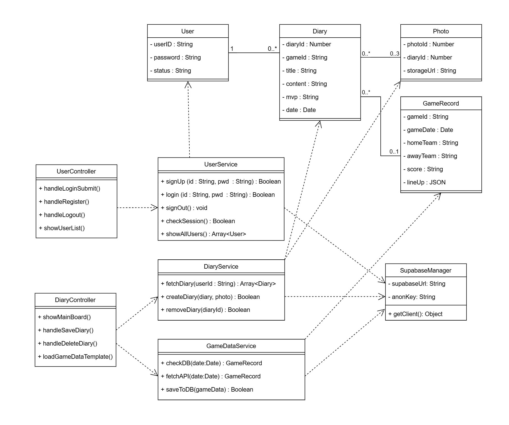

  

아래의 표는 Class Diagram에서 표현한 Class들에 대한 설명이다.

| Class Name | Explanation |
|-----|-----|
| UserController |사용자의 회원 가입, 로그인, 로그아웃 입력 이벤트를 처리하는 클래스. 관리자 계정으로 접속 시 등록된 전체 회원 목록을 화면에 출력하는 요청을 제어한다.    + handleLoginSubmit() : 사용자가 로그인 버튼을 클릭했을 때 작동한다. 입력된 아이디와 비밀번호 값을 읽어와 UserService.login() 메서드로 전달한다.   + handleRegister(): 회원가입 폼 제출 시 작동한다. 입력된 정보의 유효성을 검사한 후 UserService.signUp()을 호출한다.   + handleLogout() : 로그아웃 버튼 클릭 시 작동한다. UserService.signOut()을 호출한 뒤 로그인 화면으로 화면을 전환한다.   + showUserList() : 관리자가 '회원관리' 메뉴에 진입했을 때 작동한다. UserService.showAllUsers()가 반환한 데이터를 표 형태로 화면에 보여준다.   + handleCollectGameData() : 관리자가 '경기 정보 불러오기' 버튼을 클릭했을 때 작동한다. GameDataService 클래스의 fecthAPI() 메서드를 통해 경기 정보를 불러오도록 한다. 
| DiaryController |사용자가 작성한 일기 목록을 메인 화면에 출력하고, 새로운 일기 작성 및 삭제 이벤트를 처리한다.    + showMainBoard() : 메인 화면 로드 시 작동한다. DiaryService.fetchDiary()를 호출해 사용자 본인의 일기 목록을 가져와 액자형 UI로 보여준다.   + handleSaveDiary(): 일기 작성 폼에서 '저장' 클릭 시 작동한다. 작성된 텍스트와 첨부된 사진 파일을 DiaryService.createDiary()로 전달한다.   + handleDeleteDiary() : '삭제' 버튼 클릭 시 작동하며, 확인 창을 띄운 후 DiaryService.removeDiary()를 호출한다.   + loadGameDataTemplate() : '경기 기록 불러오기' 버튼 클릭 시 작동한다. 날짜 정보를 바탕으로 GameDataService를 호출하여 얻은 라인업/스코어 데이터를 야구장 필드 이미지 UI 위의 지정된 좌표에 텍스트로 배치한다.  |
| UserService | 사용자 인증과 세션 관리를 전담하는 클래스이다. 입력된 정보를 바탕으로 로그인/회원가입 로직을 수행하며, 관리자의 전체 회원 조회 요청 시 데이터베이스의 RLS 정책을 거쳐 유저 목록을 반환한다.    + signUp(id:String, pwd:String) : 전달 받은 아이디와 비밀번호로 Supabase Auth에 새 계정 생성을 요청한다. boolean 값을 반환한다.   + login(id: String, pwd: String) : DB의 회원 정보와 대조하여 로그인을 수행하고 인증 토큰(세션)을 발급받는다. 성공 여부를 Boolean으로 반환한다.   + signOut() : 현재 접속 중인 사용자의 세션을 만료시키고 통신을 종료한다.   + checkSession() : 브라우저를 새로고침 해도 로그인이 유지되도록 현재 클라이언트에 유효한 인증 토큰이 남아있는지 검증한다.   + showAllUsers() : DB의 전체 사용자 목록을 조회하여 User 객체 배열 형태로 반환한다. Status가 ADMIN인 계정으로 실행할 때만 정상 작동한다.  |
| DiaryService | 일기 데이터의 생성, 조회, 삭제 로직을 전담한다. 일기 텍스트 데이터는 데이터베이스에, 첨부된 이미지 파일은 스토리지에 저장하고 이를 매핑하여 반환한다.    + fetch(useId:String) : 특정 사용자의 아이디를 기준으로 DB의 diaries 테이블을 조회하여 해당 유저가 쓴 일기 객체들의 배열을 반환한다.   + createDiary(diary: Object, photo: Object) : 전달받은 사용자가 입력한 일기 텍스트 데이터는 데이터베이스에 삽입하고, 사진 파일은 Storage에 업로드한다. 두 작업이 모두 정상 처리되었는지 여부를 Boolean으로 반환한다.   + removeDiary(diaryId: Number) : 특정 고유번호(diaryId)를 가진 일기 데이터와 사진 파일을 DB 및 Storage에서 완전히 삭제한다. |
| GameDataService | 스포츠 API를 활용하여 경기일정, 스코어, 선발 라인업 등의 정보를 자동 로드하는 핵심 자동화 로직을 수행한다. DB에 해당 날짜의 데이터가 없을 경우 외부API를 호출하여 데이터를 수집하고 DB에 저장한다.    + checkDB(date: Date) : 해당 날짜의 KBO 경기 데이터가 이미 DB에 수집되어 있는지 우선 조회하고, 존재한다면 그 GameRecord 객체를 반환한다.   + fetchAPI(date: Date) : 외부 스포츠 API로 경기 일정과 라인업 데이터를 긁어와 GameRecord 객체로 정제하여 반환한다.   + saveToDB(gameData: Object) : fetchAPI()를 통해 외부에서 새로 수집한 경기 데이터를 시스템 데이터베이스에 영구적으로 저장한다. |
| User | 시스템을 이용하는 사용자의 계정 정보를 정의하는 클래스이다.   아이디 userID, 비밀번호 password, 일반/관리자 권한을 구분하는 상태값 status을 가진다. |
| Diary | 사용자가 작성한 야구 일기 본문 데이터를 저장하는 클래스이다. 특정 경기와 연동되며, 1명의 유저가 여러 개의 일기를 가질 수 있는 1:N 관계를 형성한다. |
| Photo | 일기에 첨부되는 이미지 데이터를 관리하는 클래스이다. 시스템 스토리지에 업로드된 사진의 웹 주소를 보관하며, 하나의 일기에 최대 3장까지 첨부될 수 있다. |
| GameRecord | 시스템이 수집해 둔 KBO 경기 기록 데이터를 담는 클래스이다. JSON 형태의 라인업과 최종 점수 등을 포함한다. |
| SupabaseManager | Supabase SDK를 초기화하고 DB 연결 세션을 관리하는 클래스이다.    +getClient() : 초기화된 Supabase DB 통신 세션 객체를 반환한다. 모든 Service 클래스들은 DB에 접근해야 할 때 이 메서드를 호출하여 통신 채널을 확보한다. |

- - -

## 3. Sequence diagram

아래 나오는 그림들은 Conceptualization에서 표현한 기능들을 Sequence Diagram으로 표현한 그림들이다. 

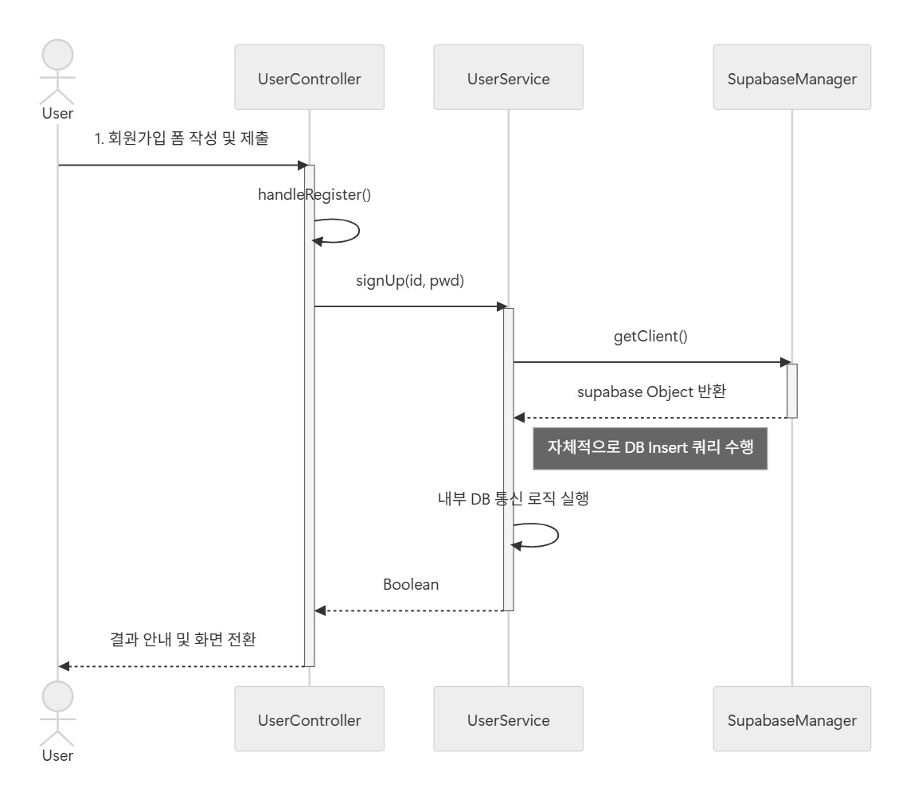

 

 위의 시퀀스 다이어그램은 회원가입 기능을 나타낸 것이다. 사용자가 회원가입 폼을 작성하고 제출 버튼을 누르면, UserController가 입력값을 검증한 뒤 UserService의 singUP() 메소드를 호출하고 DB에 사용자 정보를 저장한 후 회원 가입 성공 여부를 화면에 띄워준다.  

 

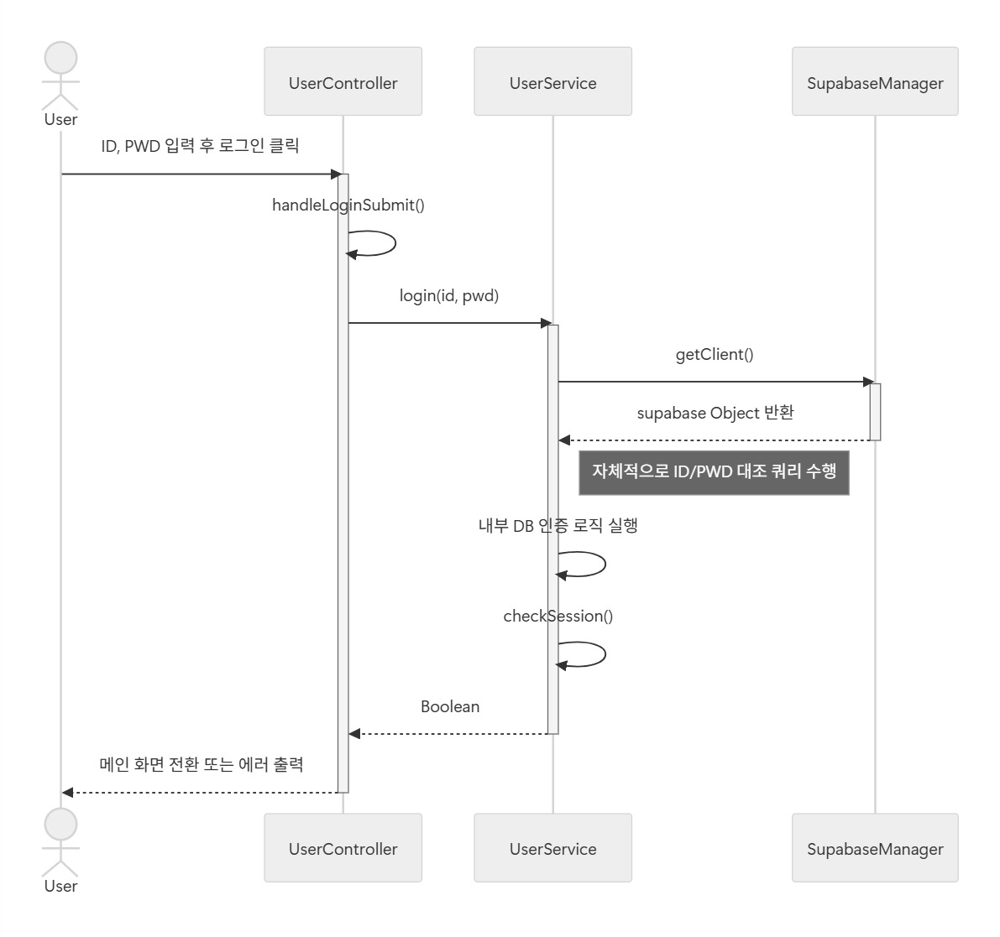

 

 위의 시퀀스 다이어그램은 로그인 기능을 나타낸 것이다. 사용자가 아이디와 비밀번호를 입력하고 로그인 버튼을 누르면, 해당 입력값을 UserController가 검증한 뒤 login() 메소드가 호출하여 넘기면 서비스 내부 로직을 통해 DB 데이터와 대조 작업을 수행한다. 인증이 성공하면 세션을 검증한 후 로그인 성공 여부를 반환한다. 

 

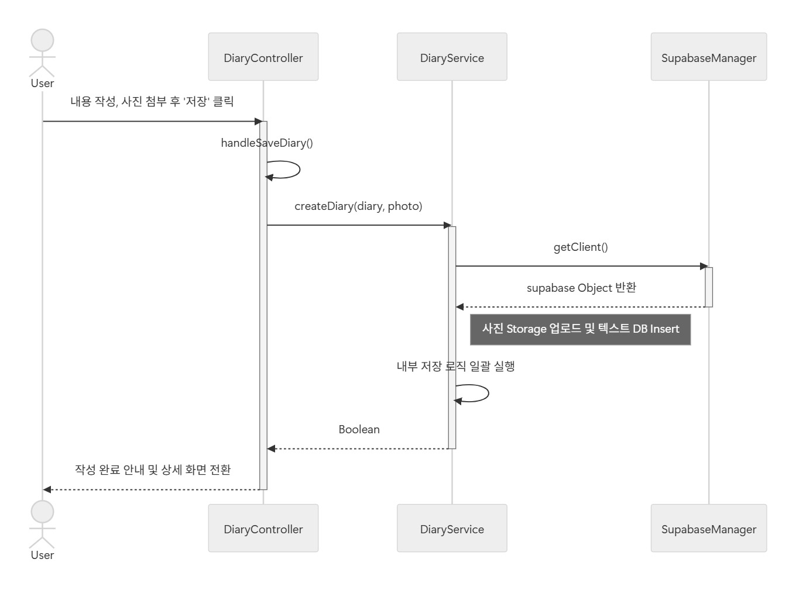

 

 위의 시퀀스 다이어그램은 일기 작성 기능을 나타낸 것이다. 사용자가 일기를 작성하고 사진을 첨부한 후 저장을 누르면 입력 데이터를 DiaryController가 DiaryService로 전달한다. 이미지 파일이 존재한다면 스토리지에 업로드하여 URL을 확보하고, 이후 해당 URL과 일기 본문 데이터를 결합하여 DB에 저장한다. 이후 저장 성공 여부를 반환한다

 

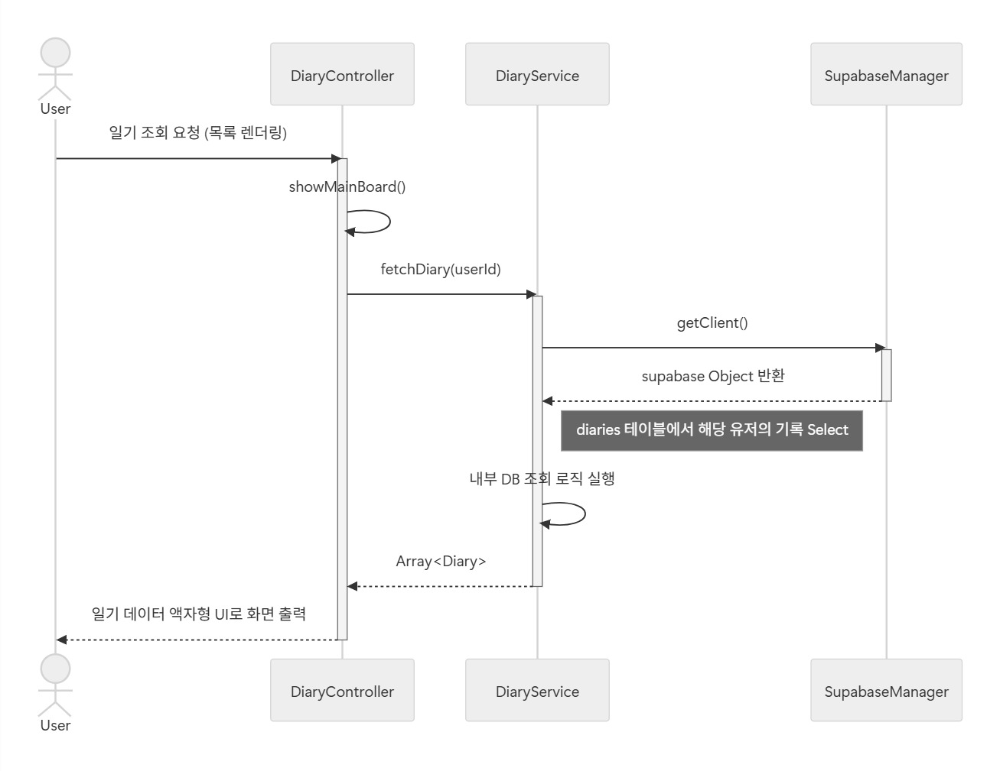

 

 위의 시퀀스 다이어그램은 일기 조회 기능을 나타낸 것이다. 메인 화면 접속 시 DiaryController가 DiaryService의 fetchDiary()를 호출한다. 내부 쿼리 로직을 통해 DB의 diaries 테이블에서 해당 유저의 기록을 Select하여 Array<Diary> 형태로 반환하고, 컨트롤러는 반환받은 객체 데이터를 바탕으로 화면에 액자형 UI를 출력한다.

 

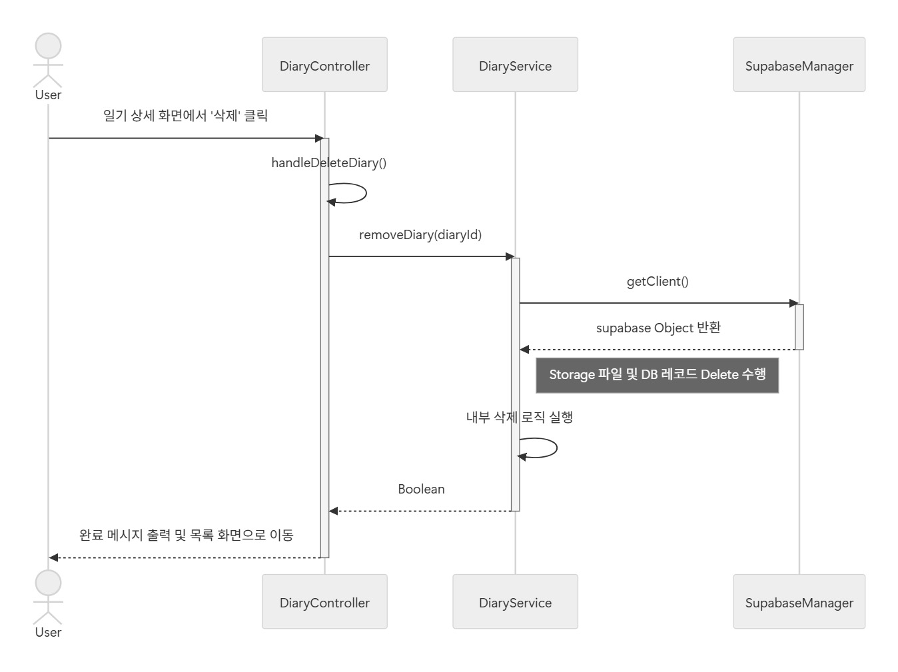

 

 위의 시퀀스 다이어그램은 일기 삭제 기능을 나타낸 것이다. 사용자가 삭제를 확정하면 DiaryController가 고유 번호(diaryId)를 DiaryService에 전달한다. 서비스 내부적으로 DB의 일기 레코드 삭제와 스토리지에 저장되어 있던 첨부 사진 파일의 삭제 로직까지 일괄적으로 처리한 후 최종 결과를 컨트롤러로 반환한다.

 

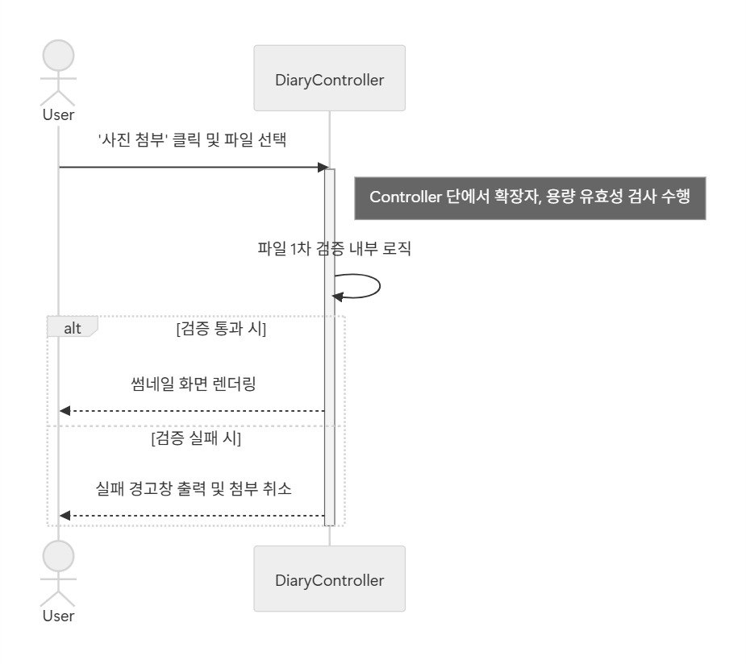

 

 위의 시퀀스 다이어그램은 사진 첨부 기능을 나타낸 것이다. 선택된 파일의 확장자와 용량을 1차적으로 검증하고 통과 시 화면에 썸네일을 출력하고 실패 시 에러 경고창을 띄워 잘못된 파일의 업로드를 사전에 차단한다. jpg, png 확장자의 파일만 업로드 가능하며, 최대 3개까지 업로드 가능하다.

 

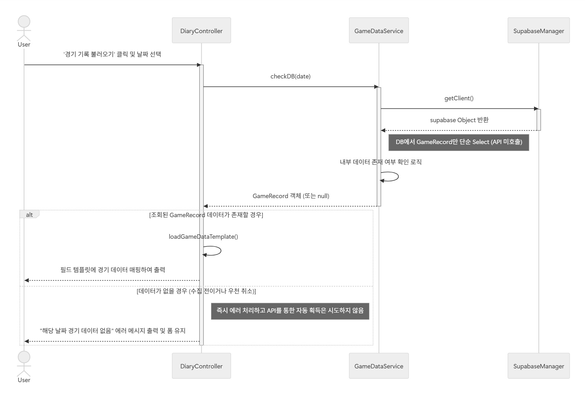

 

 위의 시퀀스 다이어그램은 데이터 불러오기 기능을 나타낸 것이다. GameDataService가 시스템 DB를 조회하여 사용자가 불러오기 요청한 날짜의 GameRecord가 존재하는지 확인한다. 데이터가 존재할 경우 DiaryController가 이를 반환받아 loadGameDataTemplate() 메서드를 통해 필드 UI에 매핑하며, 데이터가 없을 경우 즉시 에러 메시지를 출력하여 불러오기를 실패 처리한다.

 

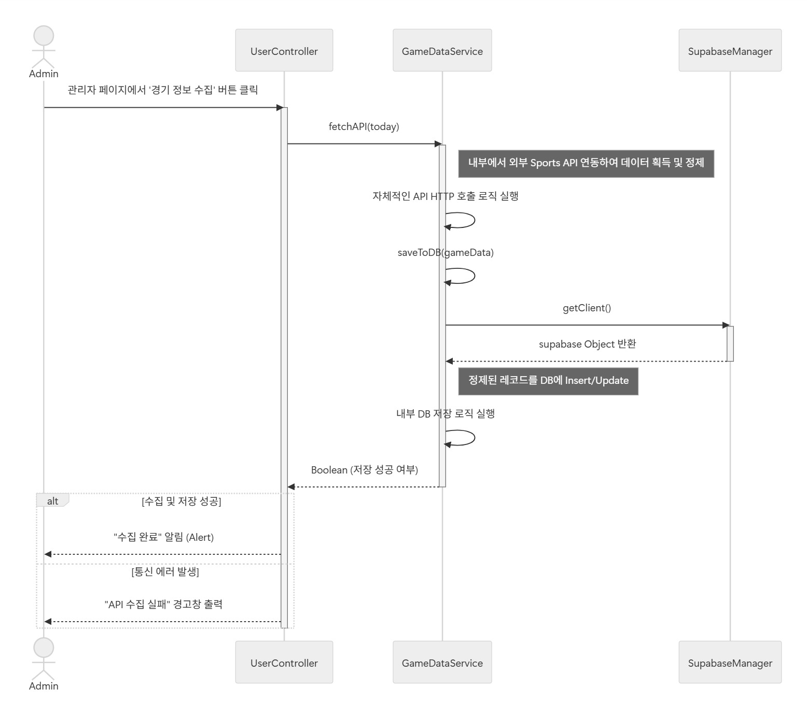

 

 위의 시퀀스 다이어그램은 데이터 수집 기능을 나타낸 것이다. 관리자가 수집 버튼을 클릭하면 UserController에서 GameDataService의 fetchAPI() 메소드를 호출한다. 이후 외부 API 통신, 데이터 정제, 내부 DB Insert를 순차적으로 수행하여 경기 정보를 수집하여 DB에 저장하고 성공 여부를 관리자에게 반환한다.

 

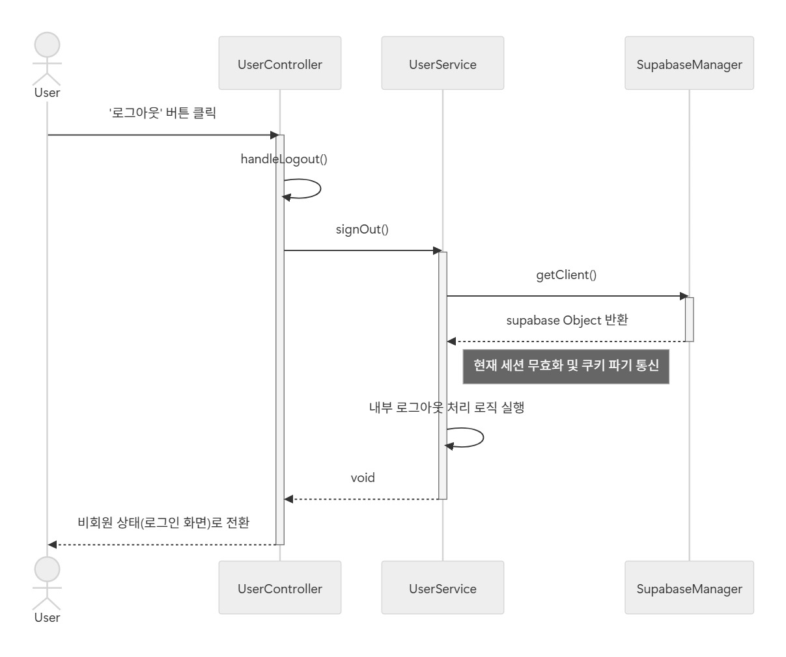

 

 위의 시퀀스 다이어그램은 로그아웃 기능을 나타낸 것이다. 로그아웃 요청 시 UserService가 SupabaseManager를 호출하여 클라이언트 측의 토큰 파기 및 DB 측의 세션 만료 통신을 수행한다. 처리가 완료되면 UserController가 로그인 화면(비회원 상태)으로 사용자를 리다이렉트한다.

 

 

 위의 시퀀스 다이어그램은 회원관리 기능을 나타낸 것이다. 관리자가 시스템에 가입한 전체 사용자의 목록을 조회하고 상태를 제어하기 위한 기능이다. UserService 내부에서 권한 여부를 확인한 후, DB 전체 회원 목록을 배열로 반환한다. 획득한 Array<User> 데이터를 UserController가 넘겨받아 테이블 형태로 화면에 출력한다.

 

- - -

## 4. State machine diagram

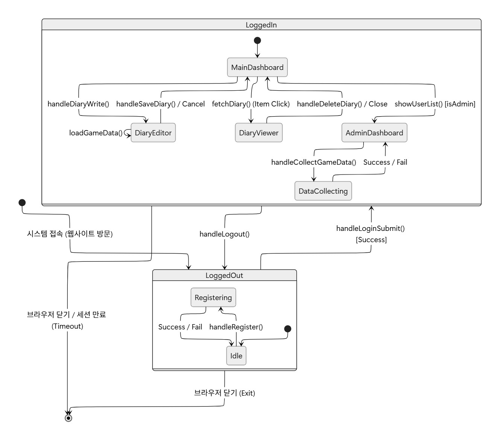

크게는 비로그인(LoggedOut) 상태와 로그인(LoggedIn) 상태라는 두 개의 복합 상태로 나뉘어 진다.

초기 접속 시에는 사용자가 비로그인 상태의 Idle 상태로 진입한다.
handleRegister() 액션을 통해 회원가입을 진행하는 Registering 상태로 전이되며, 성공 또는 실패 후 다시 Idle 상태로 돌아온다. 로그인 시도하며 handleLoginSubmit() 이벤트 발생 시 인증에 실패하면 Idle 상태에 머무르고, 성공 시 LoggedIn 상태로 전이 된다. 

로그인 성공 후에는 MainDashboard에 위치하게 된다. 일기작성을 하게 되면 Editing 상태가 되고 내부에서 사진 첨부와 경기 데이터 불러오기 등의 이벤트가 발생하게 된다. 
작성을 취소하거나 저장하고 나면 다시 메인 대시보드로 돌아온다. 

특정 일기를 메인 대시보드에서 클릭하여 DiaryView 상태에 진입할 수 있으며 닫기 버튼을 누르거나 삭제 (handleDeleteDiary())가 완료되면 대시보드로 돌아온다.

관리자 패널 (AdminDashboard)에는 status가 ADMIN인 사용자만 접근 가능하다. AdminIdle 상태에서 데이터 수집하기를 통해 handleCollectGameData()를 실행하여 DataCollectiong 상태로 전이된다. 이 상태는 경기 데이터를 외부 API를 통해 수집하는 과정이다. 

LoggedIn 상태에서 사용자가 직접 로그아웃(handleLogout()) 하거나 세션이 만료 (Token 만료)되면 다시 LoggedOut 상태로 돌아간다. 

어느 상태에서든 브라우저 탭을 답으면 최종 노드로 이동하여 시스템 사용이 종료된다. 

- - -

## Implementation requirements

- 사용자 인증(Auth), 데이터베이스(DB), 파일저장소(스토리지)는 Supabase 환경을 기반으로 구축한다. 
- KBO 경기 정보를 자동으로 불러오기 위해 신회할 수 있는 외부 Sports API를 연동해야한다.  

- - -

## Glossary

- (Supabase) Auth: 사용자 회원가입, 로그인, 로그아웃 및 세션 토큰 발급 등 전반적인 사용자 인증 관리를 제공하는 Supabase의 내장 보안 서비스
- RLS (Row Level Security): 데이터베이스 테이블의 행(Row) 단위로 읽기/쓰기/삭제 접근 권한을 제어하는 보안 정책. 본인(User)이 작성한 야구 일기만 제어할 수 있도록 강제할 때 사용된다.

- - -

## Reference